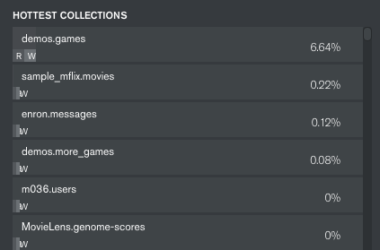
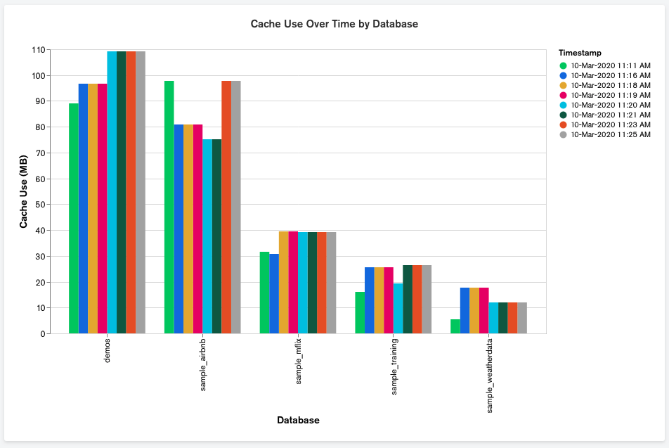

# MongoDB Database Statistics

MongoDB provides detailed statistics at the collection level via its [collStats](https://docs.mongodb.com/manual/reference/command/collStats/#dbcmd.collStats) and [top](https://docs.mongodb.com/manual/reference/command/top/) commands. The Compass [Performance](http://docs.mongodb.com/compass/master/performance/) will even show you the Hottest Collections:



However, since it is not uncommon to have multiple application teams sharing a MongoDB cluster, it is often desirable to see this type of information rolled up to the database level. 

The [analyze-db.py](analyze-db.py) script uses information from [collStats](https://docs.mongodb.com/manual/reference/command/collStats/#dbcmd.collStats) and [top](https://docs.mongodb.com/manual/reference/command/top/) to roll up information on db cache use and a list of hottest dbs:

```
$ python3 analyze-db.py

MongoDB Database Stats

Analyzing Database Cache Use...

 Database                  Cache Used (MB)
 --------                  ---------------
 local                       1238.762
 demos                        109.216
 sample_airbnb                 97.617
 sample_mflix                  39.312
 sample_training               26.328
 sample_weatherdata            11.996
 --------                  ---------------
 Total                       1523.747

Calculting Hottest DBs...

 Database                         CPU   CPU Read  CPU Write
 --------                   ---------  ---------  ---------
 demos                          6.11%      5.77%      0.34%
 local                          0.41%      0.41%       0.0%
 sample_mflix                   0.26%       0.0%       0.0%
 enron                          0.14%       0.0%       0.0%
 --------                   ---------  ---------  ---------
 Total                          6.92%      6.18%      0.34%

Analysis Complete
```

Note the script also persists its findings back to a `dbstats` database, which allows for historical analysis. For example, you can use [MongoDB Charts](https://www.mongodb.com/products/charts) to graph the results over time:



